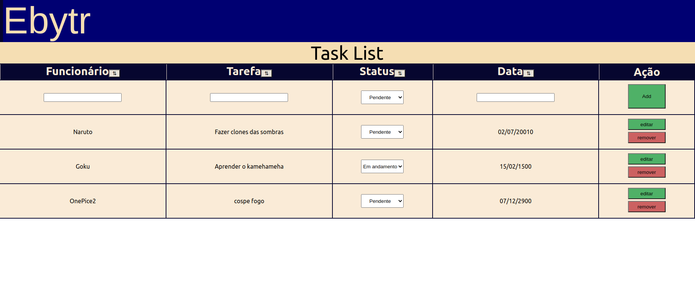

# Introdução

Essa é a aplicação Ebytr Tasklist. feita para resolver os problemas de produtividade e controle das pessoas colaboradoras da empresa. Funciona como uma lista de tarefas ordenavel e editável para permitir manter as pessoas colaboradoras on-track de seus serviços. Para a realização da aplicação foi usada o stack MERN

## Arquitetura:
O stack MERN será melhor descrito: 
- Backend: feito usando a estrutura MSC (Model, service e Controller) utilizando de NodeJS com Express.
- Database: O banco de dados foi feito com apenas uma coleção tasks utilizando mongoDB.
- FrontEnd: Uma one page application feita com ReactJS.

## Instalação:
 Para instalar o projeto é necessário:
 1.  Instalar as dependencias do backend em ./backend com `npm install`
 2. Iniciar o backend com `npm start`
 3. Instalar as dependencias do frontend em ./frontend/ebytr-frontend com `npm install`
 4. Iniciar o backend com `npm start`

## Dependencias:
A seguir estão todas as dependencias para a realização do projeto
- Bodyparser
- nodemon(desenvolvimento)
- express
- cors
- mongodb
- react
- eslint
- dotenv
- mongoose

- mocha
- chai
- chai-http
- sinon
- frisby
- jest

# Proximos passos:
- Fazer deploy no Heroku
- Adicionar tasks in real time com sockets.io
- Adicionar autenticação com JWT
- Acabar os testes unitários no backend com Mocha e Chai
- Utilizar docker para containerizar